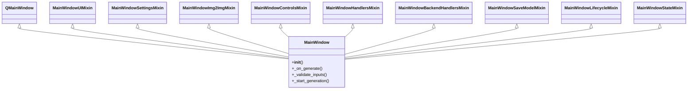

# EyeGen GUI Composition & Architecture

The `MainWindow` class in `eyegen/gui/main_window.py` is composed of multiple mixin classes to partition the PySide6 UI and event-handling code. This document describes the composition structure, shared state, and lifecycle flow.

## Mixin Architecture Overview

To maintain clean and readable files within PySide6's single-inheritance model, `MainWindow` inherits from `QMainWindow` and 9 feature-scoped mixin classes:

### Division of Concerns

1. **`MainWindow` ([main_window.py](file:///Users/jonah/Documents/Creative%20&%20Media/mygen-playground/eyegen/gui/main_window.py))**
   - The central orchestrator initializing the window.
   - Combines all mixins and delegates main action handlers (e.g. `_on_generate`).
   - Manages top-level state: `self.worker`, `self.config`, `self.pull_worker`, and `self._save_worker`.

2. **`MainWindowUIMixin` ([main_window_ui.py](file:///Users/jonah/Documents/Creative%20&%20Media/mygen-playground/eyegen/gui/main_window_ui.py))**
   - Implements UI layout setup via `_build_ui()`.
   - Structures the window grid, tabs, input fields, image preview panel, and sidebar configuration panel.

3. **`MainWindowSettingsMixin` ([main_window_settings.py](file:///Users/jonah/Documents/Creative%20&%20Media/mygen-playground/eyegen/gui/main_window_settings.py))**
   - Manages settings inputs (steps, guidance scale, seed, model aliases).
   - Validates and handles changes to advanced options (e.g. quantization levels and local paths).

4. **`MainWindowImg2ImgMixin` ([main_window_img2img.py](file:///Users/jonah/Documents/Creative%20&%20Media/mygen-playground/eyegen/gui/main_window_img2img.py))**
   - Handles the Image-to-Image UI tabs, input image file selections, and denoise strength sliders.

5. **`MainWindowControlsMixin` ([main_window_controls.py](file:///Users/jonah/Documents/Creative%20&%20Media/mygen-playground/eyegen/gui/main_window_controls.py))**
   - Dynamically enables, disables, or hides input controls when the active backend changes (e.g. hiding the Guidance field when Bonsai is active, disabling/enabling quantization, etc.).

6. **`MainWindowHandlersMixin` ([main_window_handlers.py](file:///Users/jonah/Documents/Creative%20&%20Media/mygen-playground/eyegen/gui/main_window_handlers.py))**
   - Contains slots for worker progress signals (`_on_progress`, `_on_status`, `_on_finished`, `_on_error`).

7. **`MainWindowBackendHandlersMixin` ([main_window_backend_handlers.py](file:///Users/jonah/Documents/Creative%20&%20Media/mygen-playground/eyegen/gui/main_window_backend_handlers.py))**
   - Manages backend-specific tasks, such as triggering the HuggingFace login dialog and starting model pull workers.

8. **`MainWindowSaveModelMixin` ([main_window_save_model.py](file:///Users/jonah/Documents/Creative%20&%20Media/mygen-playground/eyegen/gui/main_window_save_model.py))**
   - Manages local conversion, quantization, and model downloading tasks for the MFLUX and CoreML backends.

9. **`MainWindowLifecycleMixin` ([main_window_lifecycle.py](file:///Users/jonah/Documents/Creative%20&%20Media/mygen-playground/eyegen/gui/main_window_lifecycle.py))**
   - Controls the generation worker's execution thread lifecycle: `_start_generation`, `_stop_generation`, and cleanup (`_on_cancelled`).

10. **`MainWindowStateMixin` ([main_window_state.py](file:///Users/jonah/Documents/Creative%20&%20Media/mygen-playground/eyegen/gui/main_window_state.py))**
    - Handles serializing, saving, and restoring window geometry and UI inputs on startup and shutdown using `gui_state.json`.

---

## State and Method Delegation Pattern

Because Python class mixins resolve methods using the Method Resolution Order (MRO), they share access to the instance's dictionary (`self.__dict__`).

To ensure safety and avoid naming collisions:
- **UI Element References**: All widgets are prefixed and stored on the instance (e.g. `self.generate_btn`, `self.steps_spin`) during `_build_ui()`.
- **Private State Fields**: Shared state properties (e.g. `self._cancelled`, `self._gui_state`, `self._elapsed_timer`) are declared in `MainWindow.__init__` to make their creation trace clear.
- **Cross-mixin Calls**: Communication between mixins is done by invoking defined private methods (e.g. calling `self._update_ui_for_backend()` from the settings mixin triggers dynamic layout modifications implemented in the controls mixin).
